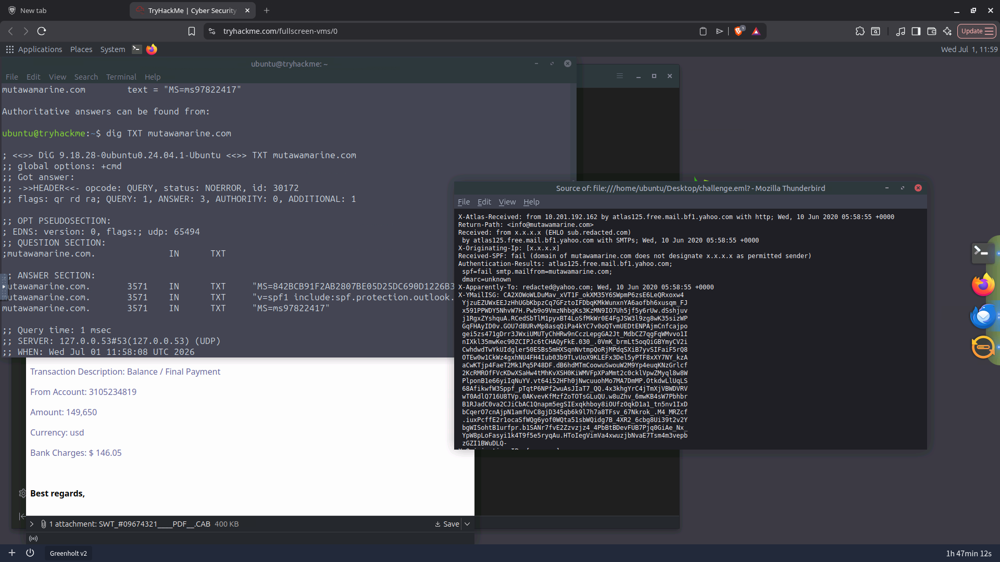
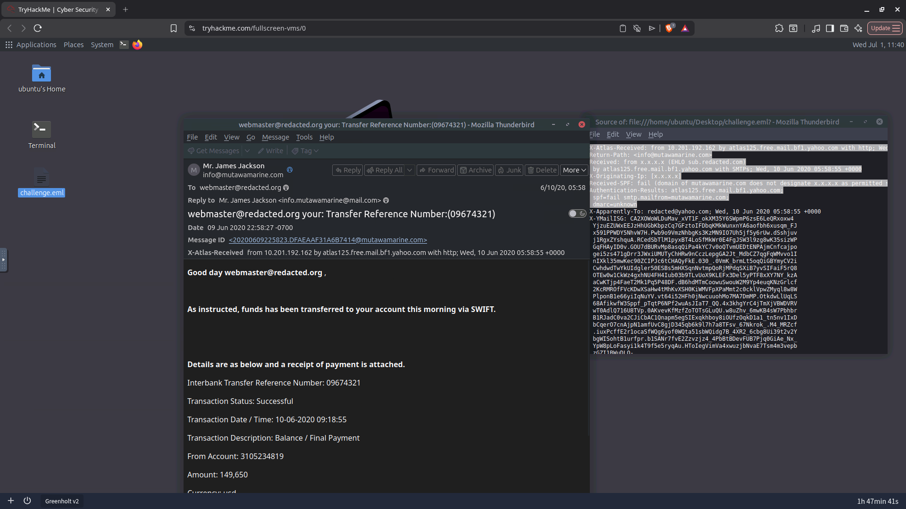

# TryHackMe - The Greenholt Phish

## Overview

This room focuses on investigating a suspicious email reported by an
employee at **Greenholt PLC**. The goal is to determine whether the
email is legitimate or part of a phishing campaign by examining email
headers, sender authentication records, and message artifacts.

> **Scenario:** A sales executive received an email from what appeared
> to be a trusted customer. The message contained a generic greeting, an
> unexpected request for a money transfer, and an unsolicited
> attachment. The email was escalated to the SOC for investigation.

------------------------------------------------------------------------

# Objectives

-   Analyze the email headers.
-   Identify important email artifacts.
-   Determine the originating source of the email.
-   Validate SPF and DMARC records.
-   Investigate sender authenticity.
-   Understand how authentication failures indicate phishing attempts.

------------------------------------------------------------------------

# Skills Practiced

-   Email Header Analysis
-   SMTP Fundamentals
-   SPF Investigation
-   DMARC Investigation
-   DNS Record Enumeration
-   Threat Hunting Mindset
-   Indicator of Compromise (IOC) Collection

------------------------------------------------------------------------

# Investigation Process

## 1. Initial Observation

Before opening attachments or clicking links, review the overall
context.

Red flags observed:

-   Generic greeting
-   Financial request
-   Unexpected attachment
-   Communication style different from previous emails

These indicators justified escalation to the SOC.

------------------------------------------------------------------------

## 2. Email Header Analysis

The email headers reveal how a message travels between mail servers.

Important headers inspected:

-   Return-Path
-   Received
-   X-Originating-IP
-   Authentication-Results
-   Received-SPF

### Key Learning

Every mail server adds a **Received** header.

The **earliest (bottom-most) Received header** generally represents the
first trusted mail server that accepted the email and is the best place
to identify the originating source.

------------------------------------------------------------------------

## 3. Originating IP Investigation

Rather than relying on the `X-Originating-IP` header, the investigation
focused on the **earliest Received header**.

Reason:

-   X-Originating-IP is optional.
-   It is not part of the SMTP standard.
-   Some providers omit or modify it.
-   The Received chain provides stronger forensic evidence.

------------------------------------------------------------------------

## 4. SPF Analysis

### What is SPF?

Sender Policy Framework (SPF) allows domain owners to publish a list of
authorized mail servers through DNS.

Purpose:

-   Prevent sender spoofing
-   Verify authorized sending infrastructure

The investigation included:

-   Extracting the Return-Path domain
-   Querying its TXT records
-   Reviewing the published SPF policy

Example:

``` bash
nslookup -type=TXT example.com
```

or

``` bash
dig TXT example.com
```

### Key Takeaway

An SPF **fail** indicates that the sending server is **not authorized**
to send mail for the claimed domain.

However, SPF failure alone is **not enough** to conclude malicious
intent. Analysts should always combine SPF with additional evidence.

------------------------------------------------------------------------

## 5. DMARC Analysis

### What is DMARC?

DMARC (Domain-based Message Authentication, Reporting & Conformance)
builds upon SPF and DKIM.

It tells receiving mail servers how to handle messages that fail
authentication.

Typical policy actions:

-   none
-   quarantine
-   reject

DMARC records are stored under:

``` text
_dmarc.domain.com
```

Example lookup:

``` bash
nslookup -type=TXT _dmarc.example.com
```

or

``` bash
dig TXT _dmarc.example.com
```

### Why DMARC Matters

DMARC helps:

-   Reduce domain spoofing
-   Improve email trust
-   Standardize handling of authentication failures

------------------------------------------------------------------------

## SOC Investigation Mindset

Rather than asking:

> "Is this phishing?"

A better sequence is:

1.  Who claims to have sent the email?
2.  Who actually sent it?
3.  Did SPF pass?
4.  Did DKIM pass?
5.  What does DMARC recommend?
6.  Are there suspicious URLs or attachments?
7.  Does the message fit normal business communication?

Evidence should always drive the conclusion.

------------------------------------------------------------------------

# Key Concepts Learned

-   Email headers act as a delivery history.
-   Received headers are more reliable than X-Originating-IP.
-   SPF records are stored as DNS TXT records.
-   DMARC policies are stored under `_dmarc.domain`.
-   Authentication failures should always be correlated with additional
    indicators before making a final verdict.

------------------------------------------------------------------------

# Commands Used

``` bash
grep "^Received:" challenge.eml

grep "Return-Path" challenge.eml

grep "X-Originating-IP" challenge.eml

nslookup -type=TXT <domain>

nslookup -type=TXT _dmarc.<domain>

dig TXT <domain>

dig TXT _dmarc.<domain>
```

------------------------------------------------------------------------

# Conclusion

This investigation demonstrated the importance of validating sender
authenticity rather than trusting the visible sender information alone.

By analyzing the email headers and DNS authentication records, it
becomes possible to identify spoofing attempts, detect authentication
failures, and build an evidence-based conclusion.

The exercise reinforces a key SOC principle:

> **Never assume an email is malicious or legitimate. Collect evidence,
> validate authentication, and reach a conclusion based on facts.**

------------------------------------------------------------------------

# Screenshots

## Image 1

> Add a screenshot of the email headers showing the **Received**,
> **Return-Path**, and **Authentication-Results** headers.



------------------------------------------------------------------------

## Image 2

> Add a screenshot showing the **SPF** and **DMARC** lookup results
> (Terminal or online lookup tool).


